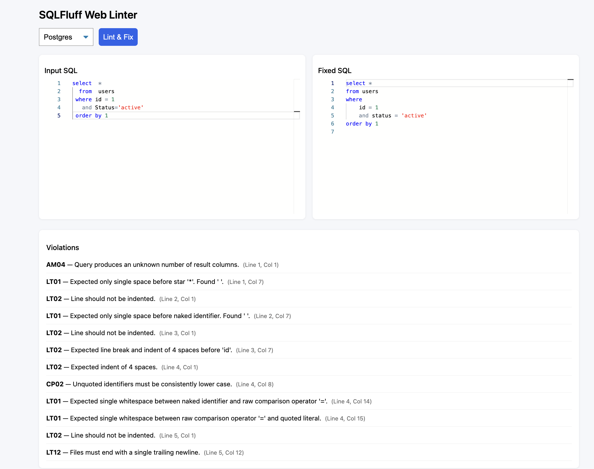
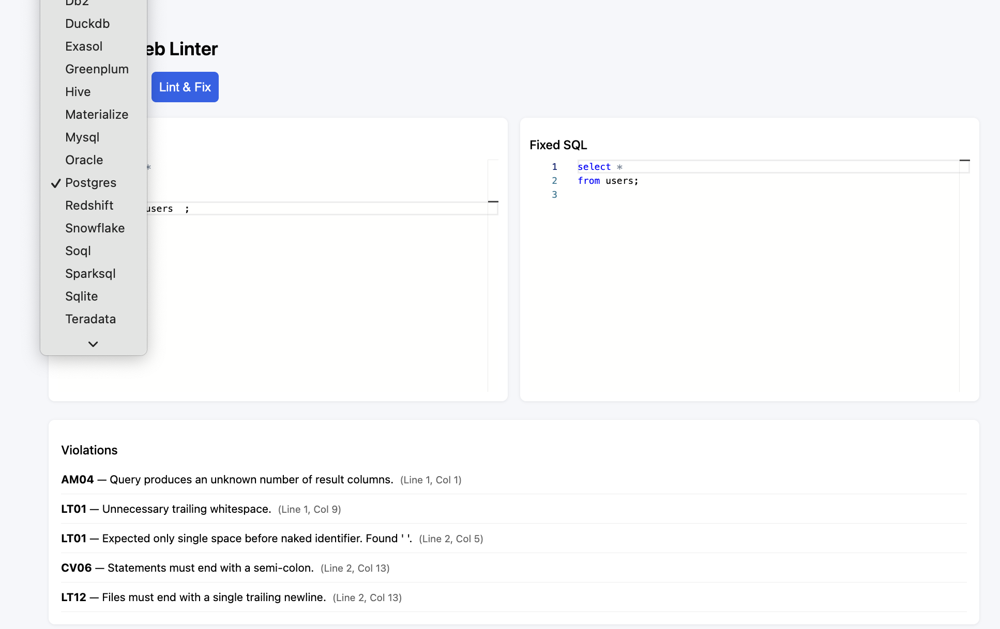

### Lint and fix sql
Based off [SQLFluff](https://www.sqlfluff.com/)

### Backend (dev)
```bash
uvicorn main:app --reload
uvicorn main:app --reload --log-level debug
python -m uvicorn main:app --reload --log-level debug
```

### Testing
```bash
pytest test_main.py -v 
```

### Frontend
```bash
npm run dev
```

### Demo
- Parsing and fix


- Supported dialects
